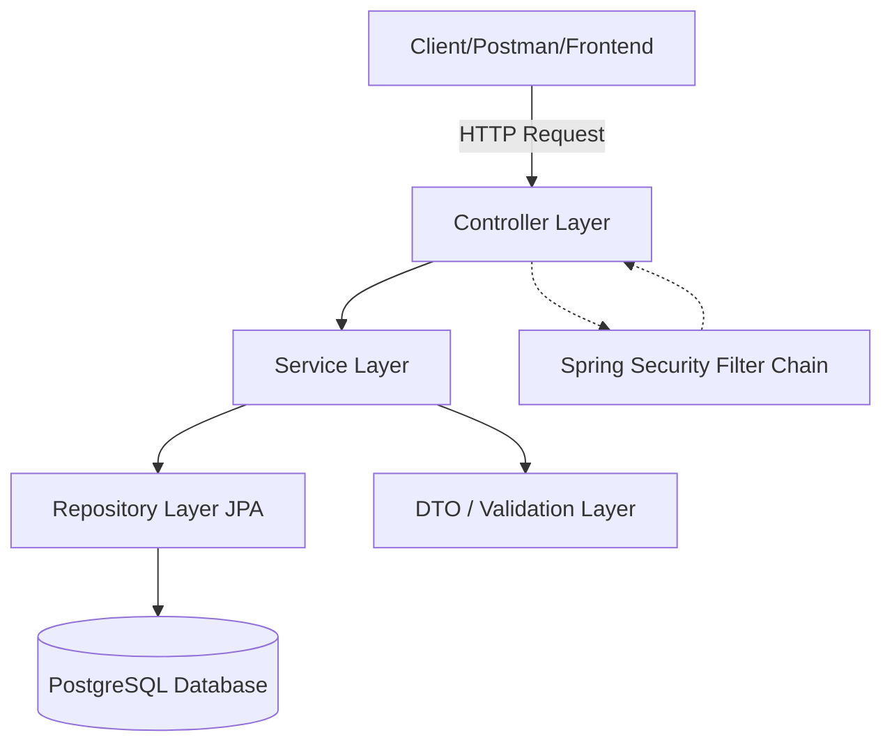
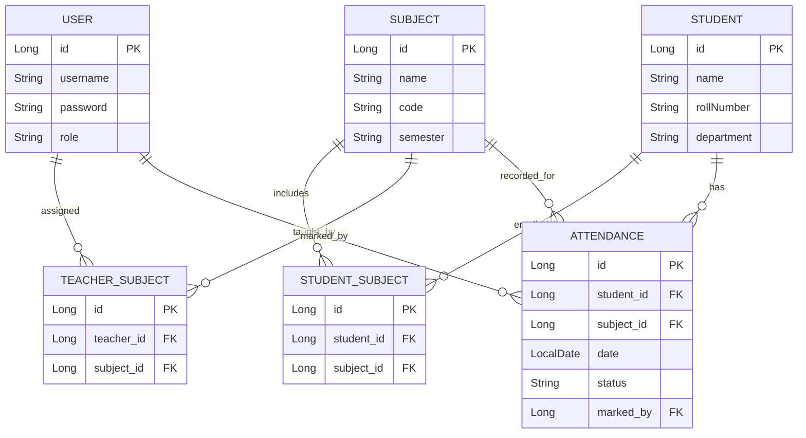

## 📖 Table of Contents

- [Description](#description)
- [Features](#features)
- [Tech Stack](#tech-stack)
- [Architecture Overview](#architecture-overview)
- [Database Schema Overview](#database-schema-overview)
- [Installation & Setup](#installation-setup)
- [Configuration](#configuration)
- [Running the Project](#running-the-project)
- [Contributing](#contributing)

<a id="description"></a>
## 📝 Description

The **College Attendance Management System** is a backend REST API built with **Spring Boot** that streamlines academic record-keeping for colleges and universities. It enables administrators to manage students, subjects, and teacher-subject assignments, while allowing teachers to mark and monitor attendance for the subjects they teach.

The system enforces **role-based access control (RBAC)**, ensuring that sensitive operations (e.g., creating students or assigning subjects) are restricted to administrators, while teachers have scoped access to attendance-related operations for their own classes.

<a id="features"></a>
## ✨ Features

| Feature | Description |
|---|---|
| 🔐 **User Authentication** | Secure login for Admins and Teachers |
| 🛡️ **Role-Based Authorization** | Distinct permissions for `ADMIN` and `TEACHER` roles |
| 👨‍🎓 **Student Management** | Create, update, view, and manage student records |
| 📚 **Subject Management** | Manage subjects offered across departments/semesters |
| 🔗 **Student-Subject Enrollment** | Map students to the subjects they are enrolled in |
| 👩‍🏫 **Teacher-Subject Assignment** | Assign teachers to the subjects they instruct |
| ✅ **Attendance Management** | Mark, update, and retrieve attendance records |
| 🧪 **Input Validation** | Request validation using Jakarta Bean Validation |
| 🌐 **RESTful APIs** | Clean, resource-oriented API design |
| 🗄️ **PostgreSQL Integration** | Reliable relational data persistence |

<a id="tech-stack"></a>
## 🛠️ Tech Stack

<div align="center">

| Category | Technology |
|---|---|
| Language |  |
| Framework |  |
| Security |  |
| Data Access |   |
| Database |  |
| Build Tool |  |
| Utility |  |

</div>

<a id="architecture-overview"></a>
## 🏗️ Architecture Overview

The application follows a classic **layered (N-tier) architecture**, promoting separation of concerns and testability.



- **Controller Layer** – Exposes REST endpoints, handles request/response mapping.
- **Service Layer** – Contains business logic and orchestrates operations.
- **Repository Layer** – Interfaces with the database via Spring Data JPA/Hibernate.
- **Security Layer** – Intercepts requests for authentication and role-based authorization.
- **DTO/Validation Layer** – Ensures clean data contracts and enforces input validation.

<a id="database-schema-overview"></a>
## 🗃️ Database Schema Overview

The system is built around six core entities that model the academic relationships between users, students, subjects, and attendance.



| Entity | Purpose |
|---|---|
| `User` | Stores login credentials and role (`ADMIN` / `TEACHER`) |
| `Student` | Holds student profile and academic details |
| `Subject` | Represents a course/subject offered |
| `StudentSubject` | Join entity mapping students to enrolled subjects |
| `TeacherSubject` | Join entity mapping teachers to assigned subjects |
| `Attendance` | Records daily attendance per student, per subject |

<a id="installation-setup"></a>
## ⚙️ Installation & Setup

### Prerequisites

- Java 17+
- Maven 3.8+
- PostgreSQL 13+
- Git

### Clone the Repository

```bash
git clone https://github.com/sayandwip2004/Students_Attendance_Database.git
cd Students_Attendance_Database
```

### Create the Database

```sql
CREATE DATABASE attendance_db;
```

### Build the Project

```bash
mvn clean install
```

<a id="configuration"></a>
## 🔧 Configuration

Update `src/main/resources/application.properties` with your local database credentials:

```properties
spring.datasource.url=jdbc:postgresql://localhost:5432/attendance_db
spring.datasource.username=postgres
spring.datasource.password=your_password
spring.datasource.driver-class-name=org.postgresql.Driver
spring.jpa.hibernate.ddl-auto=update
spring.jpa.show-sql=true
spring.jpa.properties.hibernate.dialect=org.hibernate.dialect.PostgreSQLDialect
app.jwt.secret=your_jwt_secret_key
app.jwt.expiration-ms=86400000
```

<a id="running-the-project"></a>
## ▶️ Running the Project

### Using Maven

```bash
mvn spring-boot:run
```

### Using the Packaged JAR

```bash
mvn clean package
java -jar target/college-attendance-management-system-0.0.1-SNAPSHOT.jar
```

The API will be available at:

```
http://localhost:8080
```

<a id="contributing"></a>
## 🤝 Contributing

Contributions are welcome! To contribute:

1. Fork the repository
2. Create a feature branch (`git checkout -b feature/your-feature`)
3. Commit your changes (`git commit -m 'Add some feature'`)
4. Push to the branch (`git push origin feature/your-feature`)
5. Open a Pull Request

Please ensure your code follows existing style conventions and includes relevant tests.


<div align="center">

⭐️ If you found this project useful, consider giving it a star!

</div>
